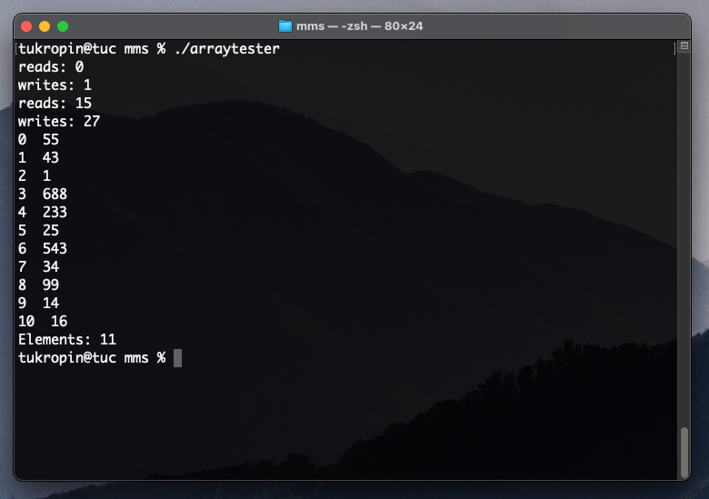

# Memory-Management-System
Memory Management System in a binary file on disc used to compare the performance of linked list and array libraries

Project Summary: This project allows you to compare performance between arrays and linked lists in the most raw format possible. The project has two components, the
first is a memory management library (ds_memory.c & ds_memory.h) which contains functions for creating files, reading from files, writing to files,
allocating memory, and freeing memory. This library will be used by the second component of the project, the array and linked list libraries (ds_arrary.c,
ds_array.h, ds_list.c, ds_list.h). These libraries include functions for inserting, deleting, swapping, replacing, searching, and reading elements from each
data structure. The programs arraytester.c and listtester.c can be used to use the array and linked list libraries. After performing operations with these data
structures the program will show the contents of each data structure, as well as the amount of reads and writes required to perform each operation.

Tools used: C, Make

